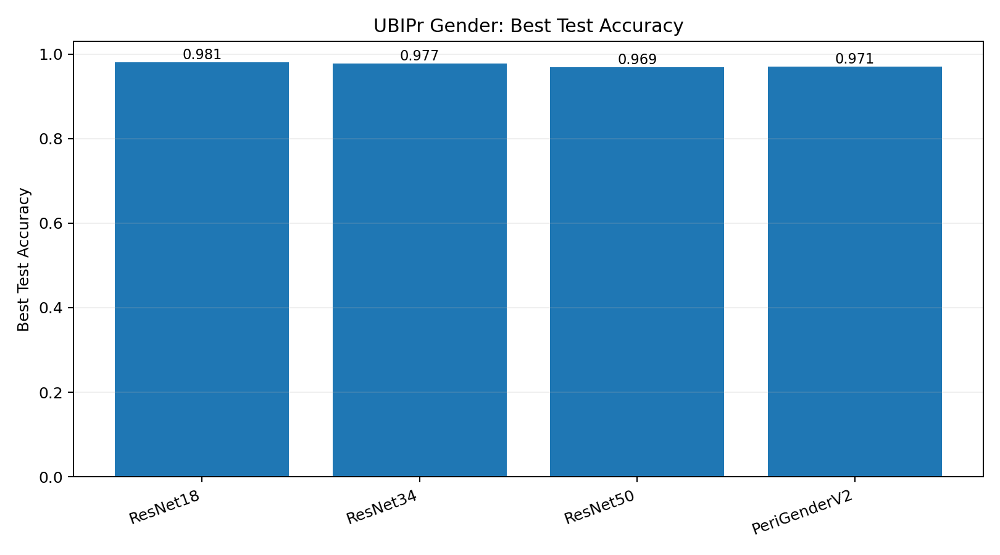
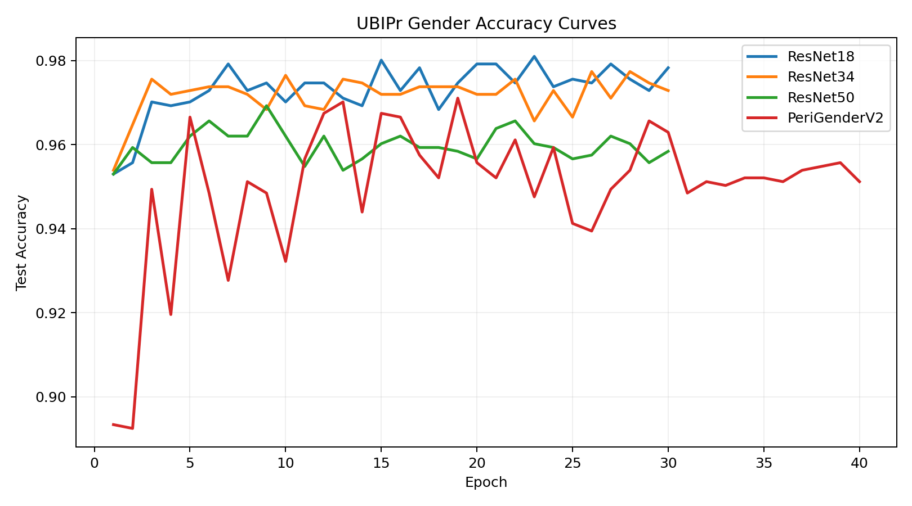

# Experiment Runs

This folder stores the reproducible CLI-first experiments for the refreshed version of the project.

The new work improves on the original notebook-era results in two important ways:

- the pipelines are now scriptable and reproducible from the terminal
- the evaluation is stricter, especially for UBIPr gender where train and test are now split by subject to avoid identity leakage

## Layout

```text
runs/
  age/
    README.md
    periocular/
      baselines/
      custom/
      hybrid/
      legacy/
  gender/
    README.md
    ubipr/
      baselines/
      custom/
```

Each training command writes a timestamped subdirectory under the requested `--output-dir`. A typical run directory contains:

- `best.pt`: checkpoint with the best validation or test accuracy seen during training
- `metrics.json`: full epoch history
- `eval.json`: post-hoc evaluation output for selected canonical runs

## Canonical Results

### Periocular Age

- Best baseline: `ResNet34` at `0.8508` test accuracy
- Best custom scratch-style model: `PeriAgeV2` at `0.7983`
- Best overall model: `PeriAgeResNet34` hybrid fine-tune at `0.8668`

### UBIPr Gender

- Best baseline: `ResNet18` at `0.9810` image accuracy
- Best custom model: `PeriGenderV2` at `0.9711` image accuracy
- Subject-level majority-vote accuracy on the best runs was effectively saturated on the held-out split

## Figures

### Age overview


### Gender overview





## How To Read The Folders

- `baselines/`
  ImageNet-pretrained ResNets used as strong transfer-learning references.
- `custom/`
  The periocular-specific architectures derived from the original research direction.
- `hybrid/`
  Architectures that keep the periocular-specific fusion idea but add a pretrained backbone.
- `legacy/`
  Early experiments kept for traceability after the training recipe was improved.

## Canonical Checkpoints Used In The Docs

The repo-level figures and summaries are anchored to these runs:

- Age baseline: `runs/age/periocular/baselines/resnet34/20260330_151158`
- Age custom v2: `runs/age/periocular/custom/periage_v2_bs32/20260330_174946`
- Age hybrid: `runs/age/periocular/hybrid/periage_resnet34_ft/20260330_202332`
- Gender baseline: `runs/gender/ubipr/baselines/resnet18_e30/20260330_212202`
- Gender baseline reference: `runs/gender/ubipr/baselines/resnet34_e30/20260330_214519`
- Gender custom v2: `runs/gender/ubipr/custom/perigender_v2_adamw/20260331_004845`

For deeper task-specific interpretation, see:

- [Age Runs](./age/README.md)
- [Gender Runs](./gender/README.md)
