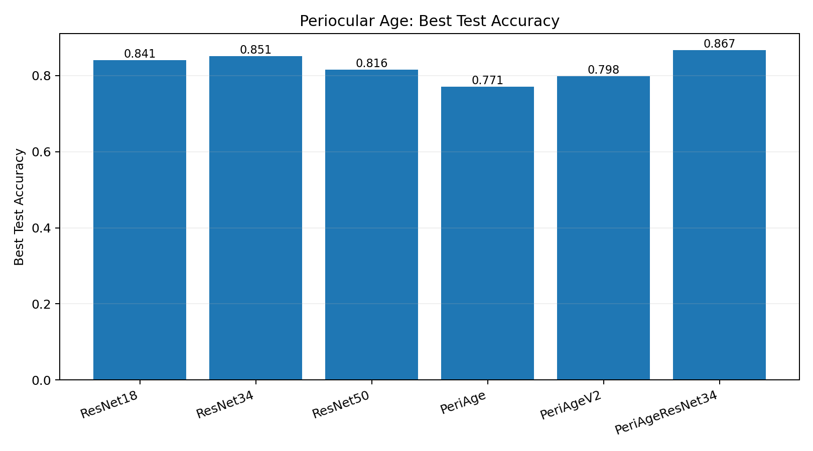
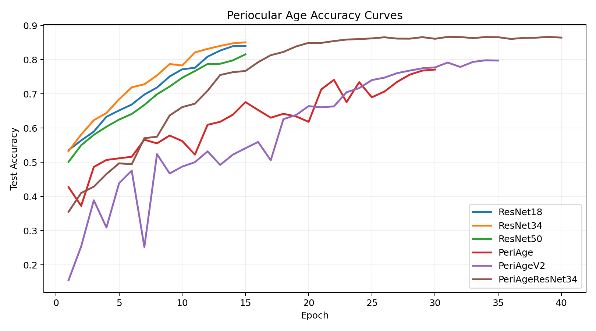

# Age Experiments

This folder contains the periocular-only age prediction experiments built from strict UTKFace periocular crops.

## Dataset Setting

- Source images: UTKFace
- Input used for these experiments: strict periocular crops only
- Labeling: decade buckets
  - `00_10`, `11_20`, `21_30`, `31_40`, `41_50`, `51_60`, `61_70`, `71_80`, `81_90`, `91_120`
- Split: image-level train/test split after periocular extraction

The key point is that these are not full-face age runs. The face is cropped down to the periocular region before training.

## Folder Structure

```text
runs/age/
  periocular/
    baselines/
    custom/
    hybrid/
    legacy/
```

## Best Runs

| Rank | Model | Variant | Best Test Accuracy | Best Epoch | Notes |
|---|---|---|---:|---:|---|
| 1 | `PeriAgeResNet34` | `hybrid/periage_resnet34_ft/20260330_202332` | `0.8668` | `31` | Best overall run |
| 2 | `ResNet34` | `baselines/resnet34/20260330_151158` | `0.8508` | `15` | Strongest plain baseline |
| 3 | `ResNet18` | `baselines/resnet18/20260330_150429` | `0.8407` | `15` | Smaller baseline, still strong |
| 4 | `ResNet50` | `baselines/resnet50/20260330_152227` | `0.8158` | `15` | Larger backbone did not help here |
| 5 | `PeriAgeV2` | `custom/periage_v2_bs32/20260330_174946` | `0.7983` | `34` | Best scratch-style custom age model |

## Interpretation

### What Worked

- A pretrained residual backbone remained a very strong starting point for periocular age prediction.
- The hybrid `PeriAgeResNet34` model was the first configuration to beat the plain `ResNet34` baseline.
- The `PeriAgeV2` fusion block and deeper classifier improved meaningfully over the original `PeriAge` design.

### What Did Not Work

- Simply making the network deeper did not help: `ResNet50` underperformed `ResNet34`.
- The original scratch-style `PeriAge` family could learn, but it lagged behind pretrained backbones until the hybrid model was introduced.
- The first attempt at a hybrid fine-tune under `legacy/` was poor because the backbone was not fine-tuned carefully enough.

## Why The Accuracy Is Lower Than Full-Face Age Models

Periocular-only age prediction is much harder than full-face age prediction because the model sees only the eye region. That removes a lot of age cues such as:

- cheek shape
- jawline
- forehead lines
- full skin texture distribution

That is why an `~86.7%` periocular-only result is already strong, even though full-face age pipelines can sometimes reach higher values.

## Canonical Comparison Figures





The age confusion-matrix outputs are generated for the canonical runs when `scripts/evaluate_age_run.py` has been executed for those checkpoints:

- `results/figures/age/resnet34_confusion.png`
- `results/figures/age/periage_v2_confusion.png`
- `results/figures/age/periage_resnet34_confusion.png`

## Recommended Reference Run

If you want one checkpoint to represent the current best age model in this repo, use:

- `runs/age/periocular/hybrid/periage_resnet34_ft/20260330_202332/best.pt`

That run currently represents the best blend of:

- periocular-specific multiscale fusion
- pretrained feature quality
- careful staged fine-tuning
