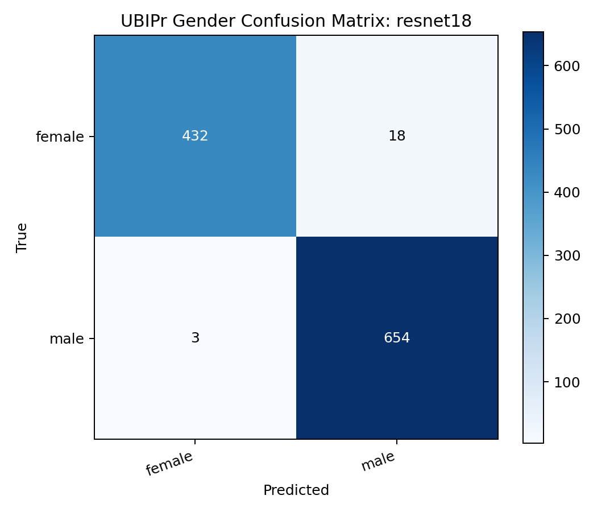
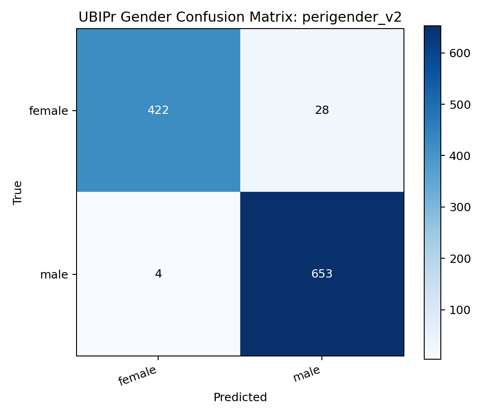

# Gender Experiments

This folder contains the UBIPr periocular gender classification experiments.

## Dataset Setting

- Source dataset: UBIPr / UBIPeriocular
- Labels: read from the paired metadata `.txt` files
- Split strategy: subject-level split
- Train balancing: female-only augmentation to match the male count in the training set
- Test set: left untouched

The subject-level split is important. The original image-level split would have leaked identity information because each subject contributes many images.

## Folder Structure

```text
runs/gender/
  ubipr/
    baselines/
    custom/
```

## Best Runs

| Rank | Model | Variant | Best Image Accuracy | Best Epoch | Notes |
|---|---|---|---:|---:|---|
| 1 | `ResNet18` | `ubipr/baselines/resnet18_e30/20260330_212202` | `0.9810` | `23` | Best overall gender run |
| 2 | `ResNet18` | `ubipr/baselines/resnet18_e50/20260330_213041` | `0.9801` | `7` | Longer run did not improve |
| 3 | `ResNet34` | `ubipr/baselines/resnet34_e30/20260330_214519` | `0.9774` | `28` | Strong reference baseline |
| 4 | `PeriGenderV2` | `ubipr/custom/perigender_v2_adamw/20260331_004845` | `0.9711` | `19` | Best custom gender model |
| 5 | `ResNet50` | `ubipr/baselines/resnet50_e30/20260330_220911` | `0.9693` | `9` | Larger baseline, slightly weaker |

## Evaluation Notes

The strong gender numbers were validated more carefully than the old workflow:

- subject overlap between train and test was checked and found to be zero
- image-level balanced accuracy remained high
- subject-level majority-vote accuracy on the top checkpoints was near-perfect on the held-out subject set

That makes the current UBIPr gender results much more trustworthy than the older image-split notebook experiments.

## Selected Evaluation Results

### `ResNet18` canonical baseline

- Image accuracy: `0.9810`
- Balanced accuracy: `0.9777`
- Subject-majority accuracy: `1.0000`

### `PeriGenderV2` best custom model

- Image accuracy: `0.9711`
- Balanced accuracy: `0.9658`
- Subject-majority accuracy: `1.0000`

### `ResNet34` reference baseline

- Image accuracy: `0.9774`
- Balanced accuracy: `0.9743`
- Subject-majority accuracy: `0.9804`

## Interpretation

### What Worked

- Transfer learning dominated the leaderboard.
- `ResNet18` turned out to be the best baseline despite being the smallest of the three ResNets tested.
- `PeriGenderV2` improved over the original `PeriGender` by adding a learnable fusion block and a stronger classifier head.

### What This Suggests

Gender from the periocular region on UBIPr appears to be a comparatively easy task relative to periocular age prediction:

- it is a binary problem
- the data is more controlled
- the periocular region preserves strong textural and structural gender cues

## Canonical Comparison Figures







## Recommended Reference Runs

If you need one baseline and one custom checkpoint to represent the refreshed gender work, use:

- baseline: `runs/gender/ubipr/baselines/resnet18_e30/20260330_212202/best.pt`
- custom: `runs/gender/ubipr/custom/perigender_v2_adamw/20260331_004845/best.pt`
